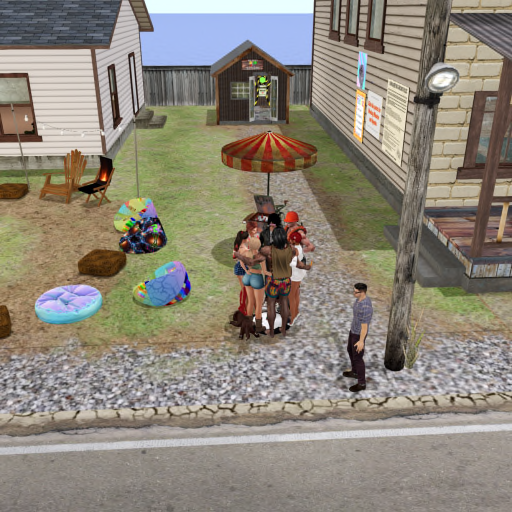
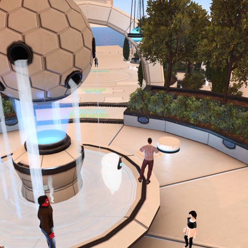

# Crafty's Second (and probably final) Meeting.

 

 

Thankfull Crafty basically has a handful of people on his friends list so the amount of editing in this is almost nothing. 

All I am doing is highlighting anuything I said with spacing and what it was that was said that I am responding to with spacing and a bullet point

I should say I did over the course of the meeting hand around a note from Talia. I left iSkye till last as she was most likely to boot me for it.

I had a thank you from two people. No one else reacted...

That note had originally been for Leo but I tweaked some of the direct refernces. I will admit it's still quite pointed, I figured people who knew that they were no involved would work out that I was just sharing with everyone.

---

As I arrive on the radio station they were talking about the fourth of July... I got a little confussed. 

---

[08:57:16] iSkye Silvercloud (iskye.silverweb) entered the region (100.32 m).

[08:57:16]  ღ Lïlÿ Vøn ℳᴀɢɪcღ (lilyvonschtupp) entered the region (89.26 m).

[08:57:16] Gin (ginhama) entered the region (96.23 m).

[08:57:16] Roliki (rolikoviekonki) entered the region (91.71 m).

[08:57:16] Bar Tenk entered the region (89.39 m).

[08:57:16] Bee (beekeeperwes) entered the region (85.40 m).

[08:57:16] Shendara Destiny entered the region (104.28 m).

You are now at Burn2, Burning Man- Deep Hole (129, 29, 24)

[08:57:24] [Now playing: Doc Pomus - Hollywood Bed - Savoy Blues 1944 – 1994]

[08:57:55] Bee (beekeeperwes) entered chat range (19.85 m).

[08:57:57] Bar Tenk entered chat range (17.90 m).

[08:57:57]  ღ Lïlÿ Vøn ℳᴀɢɪcღ (lilyvonschtupp) entered chat range (17.11 m).

[08:57:59] Roliki (rolikoviekonki) entered chat range (18.49 m).

[08:57:59] Gin (ginhama) entered chat range (18.96 m).

[08:58:04] iSkye Silvercloud (iskye.silverweb) entered chat range (18.23 m).

[08:58:14] Bee (beekeeperwes): Welcome Home  Crafty

[08:58:21] Roliki (rolikoviekonki): Hi Crafty

[08:58:44] Bee (beekeeperwes): AFK.... Brb

[08:59:02] [Now playing: No Doubt - Hella Good - The Singles Collection]

[08:59:06] Shendara Destiny entered chat range (19.06 m).

[08:59:20] Shendara Destiny: Morning, Crafty

[08:59:28] Gin (ginhama): great avi Shendara

---

[08:59:33] Crafty Hax: Hi ^^ Happy Fourth

---

[08:59:40] Shendara Destiny: Merci, Gin-chan

[09:00:07] Gin (ginhama): Happy 4th Crafty

---

[09:00:21] Crafty Hax: Lol, That is the radio confusing me.

[09:01:01] Crafty Hax: They were talking about it when I got here and I thought I had forgotten.

---

[09:01:27] [Now playing: SF Shotgun Tweety Bird (1) - Hella Good - The Singles Collection]

[09:01:40] [Now playing: Shouting Fire Patreon - Hella Good - The Singles Collection]

[09:02:23] [Now playing: How To Listen To Shouting Fire - Hella Good - The Singles Collection]

[09:02:27] Suzie (savannahsuzie) entered the region (33.19 m).

[09:02:37] [Now playing: Dale - Part 2]

[09:02:40] Suzie (savannahsuzie) entered chat range (19.29 m).

[09:02:47] iSkye Silvercloud (iskye.silverweb): HI Suzie

[09:02:56] Bar Tenk: Hi Suzie ;)

[09:02:57] Huntress Catteneo entered the region.

[09:03:06]  ღ Lïlÿ Vøn ℳᴀɢɪcღ (lilyvonschtupp): Hi Crafty and Suzie

[09:03:07] Suzie (savannahsuzie): Hello everyone  °͜°

[09:03:10] Shendara Destiny: Morning, Suzie

[09:03:14] Roliki (rolikoviekonki): Hello!

[09:03:56] Huntress Catteneo entered chat range (18.36 m).

[09:04:14] iSkye Silvercloud (iskye.silverweb): hey Huntress

[09:04:15] Suzie (savannahsuzie): Hi Huntress

[09:04:20] Bar Tenk: Hi Huntress

[09:04:27] Huntress Catteneo: hi all

[09:04:34] Shendara Destiny: G'day, Huntress.

[09:04:46]  ღ Lïlÿ Vøn ℳᴀɢɪcღ (lilyvonschtupp): Hi Huntress

[09:05:20] iSkye Silvercloud (iskye.silverweb): OK I am chairing this morning, let's get started with ground rules

[09:05:26] iSkye Silverweb: GROUND RULES FOR BURN2 MEETINGS

[09:05:28] iSkye Silverweb: • Participation in Burn2 is entirely voluntary. Please consider carefully if you want to participate and follow the 10 Principles.

[09:05:34] iSkye Silverweb: • All of us, Burners and Leads, have a right to expect respectful dialogue and discussion at meetings in accordance with our CoE.

[09:05:46] iSkye Silverweb: • Anyone who attempts to hijack a meeting, or resorts to negative accusations and insults at others will be warned once by the meeting chair. If they refuse to stop and continue that behaviour, at the request of the meeting chair they are liable for ejection from the meeting so the rest of us can get on with business. 

[09:05:57] iSkye Silverweb: 1. We follow an agenda at each meeting.

[09:05:59] iSkye Silverweb: Prior to meetings we can add agenda items to the spreadsheet found at: https://docs.google.com/spreadsheets/d/1bNQvuCdSkJe_stP6fEkXxGP4O6f74BB3cELyVqFykNo/edit?usp=sharing

[09:06:01] iSkye Silverweb: Just find the tab at the bottom for the current month & day of week.

[09:06:14] iSkye Silverweb: If available, a link to the notes from the previous week's meeting can be found in the first column of that sheet.

[09:06:22] iSkye Silverweb: At the beginning of each meeting, there will be opportunity to add anything that needs to be discussed, to the agenda.

[09:06:25] iSkye Silverweb: Once we agree to start the meeting, NO MORE ITEMS should be added to the agenda for the current meeting.

[09:06:37] iSkye Silverweb: 2. We take turns. 

[09:06:39] iSkye Silverweb: Meetings are conducted in text.

[09:06:41] iSkye Silverweb: NOTE: local chat is recorded by notetakers at meetings, and is often shared between Burn2 leads for informational purposes. 

[09:06:45] iSkye Silverweb: If you wish, you can IM the notetaker and ask for your name to be redacted from your comments on meeting notes.

[09:06:49] iSkye Silverweb: Topic discussions can flow freely, but if chat gets too fast or heated, the moderator for the meeting may ask that we slow down. 

[09:06:53] iSkye Silverweb: 3. We ask everyone to please do this: 

[09:06:55] iSkye Silverweb:     a. Use COMMENT or QUESTION in local chat when you would like to say something or ask a question. The meeting chair will watch for those and try to call on you when it's your turn to make a comment or ask a question.

[09:07:01] iSkye Silverweb:     b. Please wait to be called on so everyone gets a turn.

[09:07:07] iSkye Silverweb: PLEASE be respectful and considerate of your fellow Burners.

[09:07:11] iSkye Silverweb: Insulting or inflammatory language is not part of the Ten Principles!

[09:07:19] iSkye Silverweb: We have important things to talk about and decide, and limited time to do it.

[09:07:24] iSkye Silverweb: THANK YOU for helping to have GREAT meetings!

[09:07:46] iSkye Silvercloud (iskye.silverweb): anyone have anything they'd like to add to the agenda?

[09:08:03] Gin (ginhama): 4th of july please,

[09:08:08] iSkye Silvercloud (iskye.silverweb): OK

[09:08:34] iSkye Silvercloud (iskye.silverweb): I will also mention something - about the SL mobile app

---

[09:09:06] iSkye Silvercloud (iskye.silverweb): anyting else?

---

---

[09:09:26] Crafty Hax: So much but none is acceptable so ill just stand here.

---

[09:10:06] iSkye Silvercloud (iskye.silverweb): I am seeing a couple people typing so I am just waiting to see if they have something to add to the agenda

[09:10:24] [Now playing: Track 30 - Part 2]

[09:10:43] iSkye Silvercloud (iskye.silverweb): no one is typing now so if not, let's start

[09:10:56] iSkye Silvercloud (iskye.silverweb): first item is this: WHIMSY Update

[09:11:06] iSkye Silvercloud (iskye.silverweb): Lily would you like to start off?

[09:11:15] [Now playing: Johnny Cash - Bridge Over Troubled Water]

[09:11:43] [Now playing: Johnny Cash - Bridge Over Troubled Water - American IV: The Man Comes Around]

[09:12:50] Shendara Destiny: jk

[09:12:52]  ღ Lïlÿ Vøn ℳᴀɢɪcღ (lilyvonschtupp): Signups for for plots for Whimsy Event are going along great, We have about half the plots signed up for with almost a month to go.   

---

We still have plots available. Go to this link to sign u for camps, to perform, or to be an artist for HEARTERY.

---

https://www.burn2.org/conception-2024-whimsy/

[09:13:02]  ღ Lïlÿ Vøn ℳᴀɢɪcღ (lilyvonschtupp): Sorry.   Had a cat emergency

[09:13:32] Bar Tenk: "Catmergency"

[09:14:19]  ღ Lïlÿ Vøn ℳᴀɢɪcღ (lilyvonschtupp): I will be talking with Cuga sometime this weekend to talk about artcars

[09:14:50]  ღ Lïlÿ Vøn ℳᴀɢɪcღ (lilyvonschtupp): Now I will toss the talking stick to Bar for any updates he has on stage.

[09:15:10] Bar Tenk: Oh bugger!    ...

[09:15:10] [Now playing: Passport - Puzzle (Skit)]

[09:15:17]  ღ Lïlÿ Vøn ℳᴀɢɪcღ (lilyvonschtupp): hahaha

[09:15:25] [Now playing: Zetas - Solite Storie feat. Angelica Cascone - Didattica]

[09:15:32] [Now playing: Zero7 - Red Dust]

[09:15:54] Bar Tenk: Hmm yes   well   I'm working on it    had second thoughts ...  redo a bit  back and forth...      to loud   to boring  too   ...

[09:16:08] [Now playing: Zero 7 - Red Dust - Simple Things]

[09:16:25] Bar Tenk: ..  so    in progress I'm afraid     but I'll get there

[09:16:35] iSkye Silvercloud (iskye.silverweb): Plenty of time, Bar

[09:16:40]  ღ Lïlÿ Vøn ℳᴀɢɪcღ (lilyvonschtupp): Good enough :)

[09:17:09] Bar Tenk: hehe   plenty of time can be the issue...      :P

[09:17:16]  ღ Lïlÿ Vøn ℳᴀɢɪcღ (lilyvonschtupp): ANy updates from you, iSkye?  OR any questions from anyone on Whimsy?

[09:17:38] iSkye Silvercloud (iskye.silverweb): I'll keep on keeping on, sending notices every couple days

[09:17:49] iSkye Silvercloud (iskye.silverweb): What about the Fashionistas?

[09:18:29] iSkye Silvercloud (iskye.silverweb): The Lamplighters will meet next Sunday to plan their camp

[09:18:39] Roliki (rolikoviekonki): Awesome!

[09:18:42] Suzie (savannahsuzie): Fashionista have the 2nd rehearsal July 14th at 2pm SLT

[09:19:17] iSkye Silvercloud (iskye.silverweb): are you looking for more models, Suzie?

[09:19:39] Suzie (savannahsuzie): not at this time, tomorrow is the deadline

[09:20:24]  ღ Lïlÿ Vøn ℳᴀɢɪcღ (lilyvonschtupp): I will help Bee get his outfits and descriptions. I am his stylist. LOL

[09:20:39]  ღ Lïlÿ Vøn ℳᴀɢɪcღ (lilyvonschtupp): Hopefully today

[09:20:42] Suzie (savannahsuzie): cool beans

[09:21:17] [Now playing: Joseph Spence - 0281 We Shall Be Happy]

[09:21:44] [Now playing: Joseph Spence - We Shall Be Happy - Forever Changing: The Golden Age Of Elektra Records 1963-1973]

[09:22:04] iSkye Silvercloud (iskye.silverweb): no questions about Whimsy then?

[09:22:25] Roliki (rolikoviekonki): no, just waiting

[09:22:35] iSkye Silvercloud (iskye.silverweb): ok

[09:22:38] iSkye Silvercloud (iskye.silverweb): next item

[09:22:44] iSkye Silvercloud (iskye.silverweb): Burn2 Policy on Child Avatars and Nudity

[09:23:11] iSkye Silvercloud (iskye.silverweb): we've been updating the draft which is closed to finished - here's the link to read it  https://docs.google.com/document/d/1yp0YnzDLNIEAiTUAmOePaNITtuqoMkwAPx2iSP68b4I/edit?usp=sharing

[09:23:59] iSkye Silvercloud (iskye.silverweb): We got good feedback last Thursday and over the weekend so it's been refined a bit

[09:24:09] [Now playing: Ryuchi Sakamoto - Prayer And Salvation (Real Mccoy Mix)]

[09:24:23] [Now playing: 坂本龍一 - Prayer & Salvation (J Swinscoe's The Real Mccoy) - Prayer / Salvation Remixes]

[09:24:38] iSkye Silvercloud (iskye.silverweb): and the policy draft is based on the results of the child avatar vs. nudity poll

[09:25:33] Shendara Destiny: Glad to hear it

[09:25:44] iSkye Silvercloud (iskye.silverweb): does anyone have any questions about the policy, any feedback?

[09:25:54] Bee (beekeeperwes): Looks good

[09:26:06] Bee (beekeeperwes): Simple and to the point

[09:26:09] Roliki (rolikoviekonki): understandable

[09:27:41] iSkye Silvercloud (iskye.silverweb): if anyone has any questions after the meeting please let me know - I'll take those back to the leads

[09:29:05] iSkye Silvercloud (iskye.silverweb): The final policy will be published on the website, and information will be posted near landing area, a notice will go out to inform on the policy with link.

[09:29:32] teastin entered the region (71.99 m).

[09:29:35] teastin left the region.

[09:30:08] Bar Tenk: I think the point of it being an imposed issue from LL is well put   and we had to make a choice.

---

[09:30:47] iSkye Silvercloud (iskye.silverweb): true, it's not something we could just ignore and carry on

---

[09:31:04] [Now playing: Sam & Dave - Soul Man]

[09:31:08] iSkye Silvercloud (iskye.silverweb): OK next item is Gin's  4th of July - Meeting? Fireworks?

[09:31:25] [Now playing: Sam And Dave - Soul Man - Letter From Vietnam Vol. 1]

[09:31:29] Roliki (rolikoviekonki): Whats about fireworks?)

[09:31:47] Roliki (rolikoviekonki): How, when, what

[09:32:00] Gin (ginhama): dose someone know how to do fireworks? i don't

[09:32:20]  ღ Lïlÿ Vøn ℳᴀɢɪcღ (lilyvonschtupp): I have a couple of fireworks kits

[09:32:22] Roliki (rolikoviekonki): only in blender maybe, or gif  - i know

[09:32:34] Suzie (savannahsuzie): I have fireworks

[09:32:37]  ღ Lïlÿ Vøn ℳᴀɢɪcღ (lilyvonschtupp): I like lighting stuff on fire

[09:32:48] Bee (beekeeperwes): I think I have some also

[09:33:08] iSkye Silvercloud (iskye.silverweb): For those not in the United States, the 4th of July is America's Independence Day

[09:33:20] Huntress Catteneo: yep I have as well so loads of us lol

---

[09:33:26] Crafty Hax wonders if someone sensed their grave being walked over..  "Just ignore and carry on.... " that someone who also was pretty well know for fireworks... and trying to help people...

---

[09:33:27] iSkye Silvercloud (iskye.silverweb): big celebration with parades in many places, and fireworks in the evening

[09:33:29] Gin (ginhama): great! what time works for you all

[09:33:36] Suzie (savannahsuzie): I have the DeCuir Creations Fireworks System

[09:33:42] [Now playing: Dan Le Sac VS Scroobius Pip - Waiting For The Beat To Kick I]

[09:33:42] iSkye Silvercloud (iskye.silverweb): oo nice one Suzie

[09:33:48]  ღ Lïlÿ Vøn ℳᴀɢɪcღ (lilyvonschtupp): Canada Day is July 1

[09:34:00] iSkye Silvercloud (iskye.silverweb): OH! do we have some Canadians among us?

[09:34:04] [Now playing: Dan le Sac vs Scroobius Pip - Waiting for the Beat to Kick In - Angles]

[09:34:23]  ღ Lïlÿ Vøn ℳᴀɢɪcღ (lilyvonschtupp): we have some amongst our burner group I am sure

[09:34:26] Gin (ginhama): o thats monday

[09:34:32] iSkye Silvercloud (iskye.silverweb): tomorrow, yes

[09:34:37] Bar Tenk: heh  yeah  well   I'm living in a country that's been independent in more than 1000 years     we don't count dates  or even years anymore  ;))

[09:34:44] Roliki (rolikoviekonki): I am not in America, but love idea of fireworks

[09:34:48] Gin (ginhama): ummm could we do both

[09:35:10] Suzie (savannahsuzie): just let me know where to set them ou at and I'll leave the launcher anyone can operate

[09:35:37] iSkye Silvercloud (iskye.silverweb): I can send a notice - when will the launcher be out on the playa for this, Suzie?

[09:35:59] Gin (ginhama): excellent ty iskye

[09:35:59] Roliki (rolikoviekonki): Maybe in the events page?

[09:36:01] Suzie (savannahsuzie): yes, let me know where to put it

[09:36:16] Bee (beekeeperwes): Will there be a weenie roast?

[09:36:21] iSkye Silvercloud (iskye.silverweb): ha!

[09:36:30] Gin (ginhama): i was thinking the white box in the middle of the playa if thats ok

[09:36:33] iSkye Silvercloud (iskye.silverweb): popup event for tomorrow and Thursday?

[09:36:39] iSkye Silvercloud (iskye.silverweb): I think that's a good spot, Gin

[09:36:52] iSkye Silvercloud (iskye.silverweb): or leave it out all week, pick up Friday morning?

[09:37:17] iSkye Silvercloud (iskye.silverweb): with hmmm weenie roast, when?

[09:37:25] iSkye Silvercloud (iskye.silverweb): anyone want to organise that?

[09:38:00] Gin (ginhama): all week would be fun, if that works for all the builder

[09:38:07] Shendara Destiny: Sorry, can't.  I'll be somewhere over the Pacific on the 4th when we cross the international date line and it becomes the fifth.

[09:38:36] Gin (ginhama): can i come with you shendara!

[09:38:37] Roliki (rolikoviekonki): i do not sure about time(not SL)

[09:38:39] Bar Tenk: You can celebrate twice ;)

[09:38:41] iSkye Silvercloud (iskye.silverweb): OH wow! Great, Shen

[09:39:20] Gin (ginhama): have ppl contact me,

[09:39:20] iSkye Silvercloud (iskye.silverweb): I don't think the effigy will be in place this week so I think it would be fine if the builders don't object - and LIly is ok with it?

[09:39:51] iSkye Silvercloud (iskye.silverweb): OK so you will organise the fun for this week, Gin?

[09:39:55] Huntress Catteneo: as long as nothing on plots

[09:40:11] Gin (ginhama): eeekkk i will try my best

[09:40:26] Gin (ginhama): in the white boxes only

[09:40:32] [Now playing: Shouting Fire Station ID - Shouting Fire Station ID - It is Shouting Hot Music - Traveler In Time]

[09:40:34] iSkye Silvercloud (iskye.silverweb): Lily are you ok with Gin putting together something this week?

[09:40:46] Roliki (rolikoviekonki): 🥳

[09:41:18] Bar Tenk: HUhmm where's the stage supposed to be?

[09:41:29] [Now playing: Heineken! - Shouting Fire Station ID - It is Shouting Hot Music - Traveler In Time]

[09:41:36] [Now playing: Outkast - 306 Funky Ride]

[09:41:50] [Now playing: Reptilian God Mana Millions000dead - Biolizards (feat. Millions000dead) - Unstoppable Demon Shyt]

[09:41:57] Gin (ginhama): did you want to set the stage done this week Bar?

[09:41:58]  ღ Lïlÿ Vøn ℳᴀɢɪcღ (lilyvonschtupp): Yes.  But we also want to be mindful that we have people out building camps.

[09:42:05] [Now playing: Outkast - Funky Ride - Southernplayalisticadillacmuzik]

[09:42:19] Bar Tenk: ...  second thought ..no worries     I'll wait

[09:42:46] Gin (ginhama): i see 3 white boxs

[09:42:55] Huntress Catteneo: still should know where it goes lol

[09:43:01]  ღ Lïlÿ Vøn ℳᴀɢɪcღ (lilyvonschtupp): one is effigy, two are for teh stages

[09:43:01] [Now playing: Outkast - Funky Ride - Southernplayalisticadillacmuzik]

[09:43:37] Gin (ginhama): hummm ok so maybe not a good idea to put them in the white boxs

[09:43:54] Huntress Catteneo: just outside

[09:44:02] Suzie (savannahsuzie): I'll place the firework launchers in the middle and the trigger sign where the Bob stage should be?

[09:44:02] Huntress Catteneo: plenty of space

[09:44:03] Bar Tenk: put it in the stage one    all good

[09:44:17] iSkye Silvercloud (iskye.silverweb): nothing will be going on those 3 white markers this week, will it?

[09:44:39] Gin (ginhama): i don't want this to be in anyone way

[09:44:42]  ღ Lïlÿ Vøn ℳᴀɢɪcღ (lilyvonschtupp): As long as nothing going on in the white boxes, no problem wiuth doing fireworks there

[09:44:45] Huntress Catteneo: lodas of space forward of them

[09:45:39] Gin (ginhama): ok i will look and put a marker out, a prim

[09:46:33] iSkye Silvercloud (iskye.silverweb): are there any builders here now, that object to the idea of having these fireworks parties this week?

[09:46:50] Bee (beekeeperwes): I don't

[09:47:30] Gin (ginhama): i might put a movie up one night

[09:48:02] [Now playing: Jel - Wash Mommy,s Wittle Soldures Brain]

[09:48:06] iSkye Silvercloud (iskye.silverweb): ok

[09:48:26] iSkye Silvercloud (iskye.silverweb): Maybe LIly can check with other builders then let you know, Gin, if anyone objects?

[09:48:29] [Now playing: Jel - wash mommy's wittle solders brain - Greenball 2]

[09:48:55] Gin (ginhama): ok that would be a good idea

[09:49:03] iSkye Silvercloud (iskye.silverweb): ok

[09:49:23] GedKearney entered the region (313.49 m).

[09:49:30] GedKearney left the region.

[09:49:36] iSkye Silvercloud (iskye.silverweb): OK any more questions? If not let's go to the next item

[09:50:05] iSkye Silvercloud (iskye.silverweb): SL Mobile App  - last week I brought this up and got some names of people interested in the beta for the app

[09:50:24] iSkye Silvercloud (iskye.silverweb): the alpha was closed to select group - premium plus members

[09:50:28] iSkye Silvercloud (iskye.silverweb): then beta

[09:50:36] iSkye Silvercloud (iskye.silverweb): then now beta is expanding to premium members

[09:50:58] iSkye Silvercloud (iskye.silverweb): and those of us who are premium members in SL, may have gotten email telling us the beta is now open to us

[09:51:09] [Now playing: ...And You Will Know Us By The Trail Of Dead - 566 It Was There That I Saw You]

[09:51:28] [Now playing: ...And You Will Know Us By The Trail Of Dead - It Was There That I Saw You - Source Tags & Codes]

[09:51:50] iSkye Silvercloud (iskye.silverweb): if you are a premium or premium plus member and did not see the announcement

[09:51:56] Bar Tenk: Uhh...   sadly no    maybe US only?

[09:51:56] iSkye Silvercloud (iskye.silverweb): either in email or this

[09:52:03] iSkye Silvercloud (iskye.silverweb): https://community.secondlife.com/blogs/entry/15865-second-life-mobile-beta-now-available-for-premium-and-premium-plus-members/?click_source=firestorm_splash

[09:52:48] iSkye Silvercloud (iskye.silverweb): Bar - give it a try and see if you are able to get the app - it's available for iOS and Android

[09:53:03] iSkye Silvercloud (iskye.silverweb): assuming you are premium or premium plus

[09:53:10] Bar Tenk: sure will do   thanks

[09:53:13] iSkye Silvercloud (iskye.silverweb): ok

[09:53:34] iSkye Silvercloud (iskye.silverweb): and it sounds like the beta will soon open to the public

[09:54:24] Suzie (savannahsuzie): I hate my cell phone, threatened thousands of times to toss it in ocean .. lol

[09:54:25] iSkye Silvercloud (iskye.silverweb): From what Madori told me they are interested in its usability, and accessibility

[09:54:39] Huntress Catteneo: not quite how it sounded we had to go whenfirst mentioned

[09:54:49] Roliki (rolikoviekonki): in google was project about cardboard glasses - possible to make handmade vr set

[09:54:55] Roliki (rolikoviekonki): from mobile phone

[09:55:05] iSkye Silvercloud (iskye.silverweb): for myself, because I rely on text, and on a small screen I don't much like squinting to read text

[09:55:11] [Now playing: Juana Molina - Rio Seco]

[09:55:27] iSkye Silvercloud (iskye.silverweb): but i haven't tried it yet so will give it a chance

[09:55:46] [Now playing: Juana Molina - Río Seco - Son]

[09:55:49] Roliki (rolikoviekonki): i freemium)

[09:56:36] iSkye Silvercloud (iskye.silverweb): OK any questions? if you are a premium plus or premium members, give it a try

---

[09:57:02] iSkye Silvercloud (iskye.silverweb): moving on to the last item  Appreciations - Miranda

---

[09:57:43] iSkye Silvercloud (iskye.silverweb): Miranda is the one who originally brought this to us and wanted us to try out spending a few minutes at the end of meetings to share our appreciations of each other

[09:58:12] iSkye Silvercloud (iskye.silverweb): so, is there anyone that would like to share something?

[09:58:17] Bar Tenk: I think it's a really good idea   that I for one   appreciate ;)

[09:58:46] [Now playing: Guster - 027 Airport Song]

[09:58:56] dullahan·host.exe (bonniebelle97) entered the region.

[09:59:03] Gin (ginhama): i would like to thank Bee for the Beer and Bacon!

[09:59:07] [Now playing: Guster - Airport Song - Airport Song]

[09:59:09] dullahan·host.exe (bonniebelle97) left the region.

[09:59:13] iSkye Silvercloud (iskye.silverweb): especially bacon!

[09:59:16] Bee (beekeeperwes): You are welcome

[09:59:33] iSkye Silvercloud (iskye.silverweb): not a single bacon burnt!

[09:59:49] Gin (ginhama): how dose BLT's sound !

[09:59:52] Roliki (rolikoviekonki): I thought it appreciations to Miranda

[09:59:53] Bee (beekeeperwes): I appreciate, Cuga, and the DMV

[10:00:10] Roliki (rolikoviekonki): I appreciate sun - because it burn)

[10:00:11] iSkye Silvercloud (iskye.silverweb): no no she was the one who originally started this, Roliki

[10:00:11] [Now playing: Piccaya - Piccaya @ Fractal Chill @ AfrikaBurn 2024 Sat 2-4 PM]

[10:00:38] iSkye Silvercloud (iskye.silverweb): I am very appreciative of the builds going on up on the playa, the variety and creativity

[10:00:48] [Now playing: LVND - Shivers (Vodoom Remix) - Shivers]

[10:01:16] iSkye Silvercloud (iskye.silverweb): OK anyone else before we adjourn?

[10:02:02] iSkye Silvercloud (iskye.silverweb): OK Crafty appears to be still typing

[10:02:10] iSkye Silvercloud (iskye.silverweb): are you?

[10:02:35] iSkye Silvercloud (iskye.silverweb): maybe stuck?

---

[10:02:55] Crafty Hax: I would say it's a great idea as long as it is not being used to bury stuff.. but in the spirit of the topic.. I will give appreciations for Talia who seems to have  have managed to nail the relevance of a share with the video in the notecard you all received... NIce to meet you but I have a feeling that is me banned now...

---

[10:03:16] iSkye Silvercloud (iskye.silverweb): anyone want to make a motion to adjourn?

[10:03:18] Suzie (savannahsuzie): Feeling gratitude and not expressing it is like wrapping a present and not giving it

[10:03:26] Suzie (savannahsuzie): motion to adjourn

[10:03:31] Shendara Destiny: second

[10:03:32] iSkye Silvercloud (iskye.silverweb): agree Suzie

[10:03:36] Gin (ginhama): second

[10:03:40] Huntress Catteneo: like that Suzie

[10:03:41] iSkye Silvercloud (iskye.silverweb): ok we are adjourned at 10:03am SLT

[10:03:47] Shendara Destiny left chat range.

[10:03:47] Shendara Destiny left the region.

[10:04:21] Beer & Bacon Cart / v2.0.5: The vehicle will auto-park in 120 seconds, unless a new driver takes control.

---

[10:04:30] Crafty Hax: OH leo was the original recipient of that note

---

[10:04:36] Gin (ginhama): HUG!!!!

---

[10:04:39] Crafty Hax: please please watch the video

---

[10:04:42]  ღ Lïlÿ Vøn ℳᴀɢɪcღ (lilyvonschtupp): Thanks everyone for a great meeting

[10:04:46] Elle Thorkveld entered the region (70.19 m).

---

[10:04:50] iSkye Silvercloud (iskye.silverweb): enough, Crafty

---

[10:04:51] Roliki (rolikoviekonki): Burn on

[10:05:08]  ღ Lïlÿ Vøn ℳᴀɢɪcღ (lilyvonschtupp): Hugs to those that want them.  Complaints please file in the circular file.

[10:05:12] Bee (beekeeperwes): What's up with the group hug?

[10:05:29] iSkye Silvercloud (iskye.silverweb): hugs are always welcome

---

[10:05:33] Crafty Hax: iskye... watch the video to where they talk about door two....

---

[10:05:46] Bar Tenk: Yayyy

[10:05:48] Gin (ginhama): Lily, thank you for all your hard work

---

[10:05:53] iSkye Silvercloud (iskye.silverweb): Crafty, please stop

---

[10:05:55] Elle Thorkveld left the region.

[10:06:09] Crafty Hax: can I ask the same of you?

---

[10:06:21] iSkye Silvercloud (iskye.silverweb): STOP, Crafty

---

[10:06:28]  ღ Lïlÿ Vøn ℳᴀɢɪcღ (lilyvonschtupp): You're welcome Gin. And Thank you for trying to make Burn2 what it should be...FUN

[10:06:31] Huntress Catteneo: Crafty you have been asked to stop

[10:06:35] Crafty Hax: whut >?

[10:06:38] Bee (beekeeperwes): Where oh where did my tacodog go?

---

[10:06:41] iSkye Silvercloud (iskye.silverweb): TWICE now

[10:07:22] iSkye Silvercloud (iskye.silverweb): if you can't stop, then leave, Crafty

---

---

[10:07:35] Crafty Hax: can you just say you'll watch the video... with a workshop on mental helath issues does for circle mental healthfor pride...

---

---

[10:07:42] Gin (ginhama): block

[10:07:46] Bee (beekeeperwes): Come on Crafty?

---

[10:08:02] blesequativ entered the region.

[10:08:04] blesequativ left the region.

[10:08:12] Huntress Catteneo: ppl will do as they choose, do not try to force

[10:08:15]  ღ Lïlÿ Vøn ℳᴀɢɪcღ (lilyvonschtupp): Don't let the door hit ya where the good lord split ya

---

[10:08:31] Crafty Hax: and it's on a subject that is very pertinant to all burners as it it's about one of the 10 princles

---

[10:08:54] Gin (ginhama): i just had a crazy thought, could be set up july party on the street ?

[10:08:58] iSkye Silvercloud (iskye.silverweb): STOP Crafty

[10:09:02] iSkye Silvercloud (iskye.silverweb): third time

[10:09:23] Gin (ginhama): just like ppl do in rl, street party that way we would be out of the way of the builders

[10:09:51] iSkye Silvercloud (iskye.silverweb): that's an idea

[10:09:55] Bee (beekeeperwes): Thanks Burners

[10:10:01] iSkye Silvercloud (iskye.silverweb): the fireworks could be set off from the Saloon roof

[10:10:10]  ღ Lïlÿ Vøn ℳᴀɢɪcღ (lilyvonschtupp): Great idea

[10:10:10] Roliki (rolikoviekonki): great

[10:10:32] [Now playing: Aal - D2a - Curated Feelings IV]

[10:10:58] Gin (ginhama): YA!!!!

[10:11:00] Suzie (savannahsuzie): want me to set up on the roof?

[10:11:00] iSkye Silvercloud (iskye.silverweb): YAY! Yes!

[10:11:00] Huntress Catteneo: sounds good

[10:11:00]  ღ Lïlÿ Vøn ℳᴀɢɪcღ (lilyvonschtupp): Wooohoo

[10:11:00] Gin (ginhama): yes please Suzie

[10:11:00]  ღ Lïlÿ Vøn ℳᴀɢɪcღ (lilyvonschtupp): Partay!

[10:11:00] Huntress Catteneo: not in anyones way there

[10:11:00] Suzie (savannahsuzie): okey dokey

[10:11:00] iSkye Silvercloud (iskye.silverweb): Thank you Suzie!

[10:11:00] Bee (beekeeperwes): Can I push the button?

[10:11:05] iSkye Silvercloud (iskye.silverweb): hahaha Bee

[10:11:09] Suzie (savannahsuzie): you push so many buttons Bee

[10:11:19] Gin (ginhama): i'll set out some decorations or something

[10:11:23] Bee (beekeeperwes): Lol

[10:11:31] Roliki (rolikoviekonki): i can dance

[10:11:33] Roliki (rolikoviekonki): )

[10:11:52] Gin (ginhama): i think i have a bbq i can put out

[10:12:02] Bee (beekeeperwes): I can cook

[10:12:10] iSkye Silvercloud (iskye.silverweb): that'd be great!

[10:12:18] Huntress Catteneo: I have marshmellows >;)

[10:12:19] Gin (ginhama): Bee your in charge of the cooking and beer

[10:12:30] Bee (beekeeperwes): Hey :)

[10:12:33] Suzie (savannahsuzie): where do you want me to place the launch sign

[10:12:37] Gin (ginhama): great idea Huntress

[10:12:44] Bee (beekeeperwes): Something I can handle

[10:13:12] iSkye Silvercloud (iskye.silverweb): OK I gotta go, family thingy

[10:13:16] Xiija entered the region (210.77 m).

[10:13:21] iSkye Silvercloud (iskye.silverweb): Thanks for this group hug, burner fam!

[10:13:26] Suzie (savannahsuzie): burn on iSkye, ty

[10:13:28] Gin (ginhama): she saloon roof is flat so any place you think best Suzie

[10:13:43] Bee (beekeeperwes): I will look for you folks

[10:13:43] Suzie (savannahsuzie): ok

[10:13:45] Gin (ginhama): we are family

[10:13:48]  ღ Lïlÿ Vøn ℳᴀɢɪcღ (lilyvonschtupp): burn on

[10:13:56] Roliki (rolikoviekonki): burn on

[10:13:59]  ღ Lïlÿ Vøn ℳᴀɢɪcღ (lilyvonschtupp): Communal Effort Our community values creative cooperation and collaboration. We strive to produce, promote and protect social networks, public spaces, works of art, and methods of communication that support such interaction.

---

[10:14:01] Crafty Hax: So what happened to RIST?

---

[10:14:08] Suzie (savannahsuzie) left chat range.

[10:14:13] Gin (ginhama): burn on!

---

**** iSkye Kicks me ****

---

[10:14:16] [Second Life: Teleport completed from Burning Man- Deep Hole (214,30,24)]

[10:14:16] iSkye Silvercloud (iskye.silverweb) left chat range.

[10:14:16] Bee (beekeeperwes) left chat range.

[10:14:16] Bar Tenk left chat range.

[10:14:16] Gin (ginhama) left chat range.

[10:14:16] Roliki (rolikoviekonki) left chat range.

[10:14:16]  ღ Lïlÿ Vøn ℳᴀɢɪcღ (lilyvonschtupp) left chat range.

[10:14:16] Huntress Catteneo left chat range.

You are now at Horizons Info Hub, Horizons Cirius (128, 129, 24)

---

The note Sent 

---

When you have time to actually sit and properly absorb.... 

I know how you react to my shares.

I've been filming elsewhere as well as here.. 

Friday I was filming for Circle Mental Health. 

    https://youtu.be/GUqfwoIKopQ?t=677

   

 I know  I am not LGBTQ... but you don't know how much I can relate.. 

 Just so you know... just so you are aware of what you are doing... 

Keep in mind.. I got a ban note that for two of the accusations, the rule that  I got banned for was introduced in that notecard... 

That is against the majority of international  humans rights....you can't convict someone on a law that didn't exist until after the actions. That cover  half of what I was banned for. 

I spent weeks after that ban and trying to speak to a ranger... I think it was last week maybe that I finally got to speak with a ranger... the day after I spoke with a ranger.  Neon got banned.

Rangers SOP is Banning is a last resort.

Rangers SOP is to have a ranger Flame if that fails....

Rangers SOP is to then have 007 Flame Then if that fails ....

Then is when a ban is considered.

FLAME is Find Out, Listen, Analyse, Mediate and Explain.

Findout and Analyse I wouldn't expect to be involved in... 

Listen "MIGHJT" be something I wouldn't have noticed.. 

"Mediate" and "Explain", How precisely did I not have two instances of each that were recognisable as such BEFORE I got banned?

Please... EXPLAIN... This.

I don't know if it's been decided to bury it or not.. but as RIST seems to have done nothing since the rerport I was going to conduct a survey of my own. The differences with my Survey... It is Radically Inclusive. i.e. It's not restricted to people I think might not give me a favourable answer. So I am asking you the one question on my survey: 

Do you think my ban was right?

TT

---

